# 🚀 2-MINUTE QUICK START

**Perfect for conference talks and demos!**

## Setup (30 seconds)

**You need:**
- Docker running (Docker Desktop)
- Python 3.8+ 
- LocalStack Pro (14-day [free trial](https://www.localstack.cloud/pricing))
- 8GB+ RAM (LocalStack needs resources)

```bash
# 1. Get LocalStack Pro API key from https://www.localstack.cloud/pricing
export LOCALSTACK_AUTH_TOKEN="your_api_key"

# 2. Install Task runner (one-time)
python3 install-task.py
```

## Demo (90 seconds)
```bash
# Run complete demo - does everything!
task demo
```

**That's it!** This single command:
- ✅ Checks prerequisites
- ✅ Sets up LocalStack + all AWS services  
- ✅ Creates and uploads sample Node.js app
- ✅ Runs the complete CI/CD pipeline
- ✅ Shows published packages

**Everything is 100% local - no tokens, no internet after setup!**

## Individual Commands
```bash
task check      # Check prerequisites only
task setup      # Setup workshop only  
task monitor    # Monitor pipeline only
task packages   # Check packages only
task cleanup    # Clean everything up
```

## Fallback: Python Commands

If Task runner fails to install:

```bash
python3 setup_workshop.py       # Setup everything
python3 monitor_pipeline.py     # Watch pipeline  
python3 check_packages.py       # View results
python3 cleanup_workshop.py     # Clean up
```

---

## What This Demo Shows

```mermaid
flowchart LR
    A["📁 Sample App"] --> B["📦 S3 Storage"]
    B --> C["🔄 CodePipeline"]
    C --> D["🧪 Test Stage"]
    C --> E["📤 Publish Stage"]  
    D --> F["✅ Tests Pass"]
    E --> G["📚 CodeArtifact"]
    
    style A fill:#e1f5fe
    style B fill:#f3e5f5
    style C fill:#e8f5e8
    style D fill:#fff3e0
    style E fill:#fff3e0
    style F fill:#e8f5e8
    style G fill:#fce4ec
```



**Everything runs in LocalStack container on YOUR machine** - No AWS costs, truly local!

## Conference Talk Flow

1. **Show Setup** (30 seconds)
   ```bash
   task demo
   ```

2. **Watch Everything Happen** (90 seconds)
   - LocalStack starts
   - Sample app gets created and uploaded
   - Pipeline builds and tests the code
   - Package gets published to CodeArtifact

3. **Show Results** (30 seconds)
   ```bash
   task packages
   npm pack localstack-workshop-demo
   ```

**Total: 3 minutes + Q&A**

---

## Troubleshooting

**"Docker not running"**
→ Start Docker Desktop

**"Sample app not found"**  
→ Make sure you cloned the complete repo with `sample-app/` directory

**"Command not found"**  
→ Use `python3` instead of `python`

**"LocalStack failed"**  
→ `python3 cleanup_workshop.py --force && python3 setup_workshop.py`

---

## What Attendees Get

- Complete working CI/CD pipeline
- All source code and templates  
- Step-by-step documentation
- Production-ready patterns
- Zero AWS costs

**This is the power of LocalStack! 🎉**