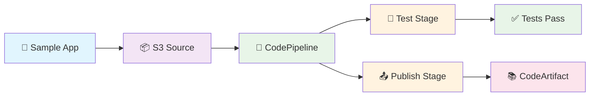

# Build Locally Deploy Globally - LocalStack AWS CI/CD Services Workshop

**Perfect for conference talks, workshops, and learning!**

A hands-on demonstration of AWS CI/CD services running locally in a LocalStack container on your machine. Build complete pipelines with zero AWS costs - everything runs locally!

🎯 **What makes this special:** 
- **🚀 Super Simple Setup** - Just one command to run everything
- **🔐 Proper IAM Configuration** - Real service roles for authentic AWS experience
- **💻 Complete Offline Operation** - No external dependencies after initial setup  
- **📱 Interactive Browser Demo** - See your pipeline results in a web interface

## 🚀 Super Quick Start (1 minute!)

**For conference attendees - just fork this repo and:**

```bash
# 1. Get LocalStack Pro API key (14-day free trial)
export LOCALSTACK_AUTH_TOKEN="your_api_key"

# 2. Run the complete demo!
task demo
# OR: bash run.sh
```

**That's it!** One simple command creates:
- ✅ Complete CI/CD pipeline (CodePipeline + CodeBuild) with proper IAM roles
- ✅ Private package repository (CodeArtifact) 
- ✅ Sample Node.js application with tests
- ✅ Interactive browser demo
- ✅ Pipeline execution monitoring with real-time status

> **✨ Production-Ready Approach:** 
> - 🚀 **One Command Setup** - `task demo` does everything!
> - 🔐 **Proper IAM Roles** - Real service roles for authentic AWS experience  
> - 💻 **Zero Configuration** - Works out of the box
> - 📱 **Pipeline Monitoring** - Watch your pipeline execute with live status updates

## 📊 Checking Your Pipeline

After running `task demo`, use these commands to explore your local AWS environment:

```bash
# Check pipeline status
aws --endpoint-url=http://localhost:4566 codepipeline list-pipeline-executions --pipeline-name demo-pipeline

# List all resources
aws --endpoint-url=http://localhost:4566 s3 ls
aws --endpoint-url=http://localhost:4566 codebuild list-projects
aws --endpoint-url=http://localhost:4566 codepipeline list-pipelines

# Check published packages
aws --endpoint-url=http://localhost:4566 codeartifact list-packages --domain demo-domain --repository demo-repo

# View your demo app
open http://localhost:4566/demo-source-bucket/demo.html
```

## What You Get

This workshop demonstrates LocalStack's CI/CD service emulation with a complete Node.js application pipeline:

**AWS Services Used:**
- **S3** - Source code storage and web hosting
- **CodeBuild** - Automated testing and building  
- **CodePipeline** - Pipeline orchestration
- **CodeArtifact** - Private package repository

**Pipeline Flow:**
1. 🔄 **Retrieves source code** from S3 storage  
2. 🧪 **Runs the test suite** using CodeBuild
3. 📦 **Publishes the npm package** to CodeArtifact



## Prerequisites

- **Docker & Docker Compose** - LocalStack runs in a container
- **AWS CLI** - For checking pipeline status  
- **Task runner** - `go-task` for easy command execution (optional - you can use `bash run.sh` directly)
- **LocalStack Pro API key** - 14-day free trial available
- **Internet connection** - Only for initial container download

**That's it!** No Node.js, Python, or complex setup required.

## 🎉 What You'll See Working

After running `task demo`, you'll have:

✅ **Complete CI/CD Pipeline** - Real CodePipeline with 3 stages running locally  
✅ **Proper IAM Configuration** - Service roles created for CodeBuild and CodePipeline  
✅ **Live Pipeline Execution** - Watch your pipeline run with real-time status monitoring  
✅ **Automated Testing** - CodeBuild running your Node.js tests  
✅ **Package Publishing** - CodeArtifact storing your npm packages  
✅ **Interactive Demo** - Browser-based app served from S3  
✅ **Zero AWS Costs** - Everything local, no cloud charges  
✅ **Real AWS APIs** - Same commands work on real AWS  

## Sample Application

The workshop includes a complete Node.js demo app with:

- **Utility functions** - Math, date, string operations
- **Test suite** - Automated tests that run in the pipeline  
- **Interactive demo** - Browser-based interface
- **Package.json** - Ready for npm publishing

**After setup, view the live demo:**
```bash
# Open the S3-hosted demo app
open http://localhost:4566/demo-source-bucket/demo.html
```

This demonstrates the complete pipeline - the app is served directly from your LocalStack S3 bucket!

## Workshop Files

```
├── README.md           # This documentation
├── run.sh             # 🚀 Main setup script - creates everything!
├── Taskfile.yml       # Task runner configuration (optional)
├── docker-compose.yml # LocalStack container config
├── sample-app/        # Demo Node.js application
└── templates/         # Pipeline configuration files
```

**Just run `task demo` and everything is created for you!**

Perfect for 10-minute conference demos! 🚀

## Troubleshooting

**"Docker not running"**  
→ Start Docker Desktop and try again

**"LocalStack services not available"**  
→ Make sure you have a valid LocalStack Pro API key: `export LOCALSTACK_AUTH_TOKEN="your_key"`

**"Pipeline execution failed"**  
→ Check status: `aws --endpoint-url=http://localhost:4566 codepipeline list-pipeline-executions --pipeline-name demo-pipeline`  
→ The script now monitors pipeline execution automatically and shows real-time status

**"Connection refused"**  
→ Wait a few seconds for LocalStack to fully start, then try again

### Cleanup

```bash
# Stop LocalStack and clean up
docker compose down
```

## Next Steps

Want to explore more? Try these:

1. **Modify the sample app** - Add new features and watch the pipeline rebuild
2. **Explore AWS services** - Use the commands above to inspect all resources  
3. **Add more tests** - Extend the test suite in `sample-app/test.js`
4. **Try real AWS** - The same commands work on real AWS (just remove `--endpoint-url`)

## Resources

- [LocalStack Documentation](https://docs.localstack.cloud/)
- [LocalStack Pro Trial](https://www.localstack.cloud/pricing) (14-day free)
- [AWS CodePipeline Guide](https://docs.aws.amazon.com/codepipeline/)

## What's New in This Version

✨ **Major Updates:**
- **Proper IAM Configuration** - Real service roles for authentic AWS experience
- **Pipeline Monitoring** - Live execution status with automatic polling
- **Improved Reliability** - Fixed LocalStack integration issues 
- **Production-Ready Setup** - Based on working LocalStack reference patterns

This workshop now provides a more realistic AWS experience while maintaining the simplicity of a one-command setup!

Perfect for conferences, workshops, and learning AWS CI/CD! 🚀