- [Build Locally Deploy Globally - LocalStack AWS CI/CD Services Workshop](#build-locally-deploy-globally---localstack-aws-cicd-services-workshop)
  - [🚀 Super Quick Start (1 minute!)](#-super-quick-start-1-minute)
    - [Step 1: Get Your LocalStack Pro API Key](#step-1-get-your-localstack-pro-api-key)
    - [Step 2: Add Your API Key to .env File](#step-2-add-your-api-key-to-env-file)
    - [Step 3: Run the Demo](#step-3-run-the-demo)
  - [🔄 What Happens When You Run the Demo](#-what-happens-when-you-run-the-demo)
  - [📊 Checking Your Pipeline](#-checking-your-pipeline)
  - [What You Get](#what-you-get)
  - [Prerequisites](#prerequisites)
  - [🎉 What You'll See Working](#-what-youll-see-working)
  - [Sample Application](#sample-application)
  - [Workshop Files](#workshop-files)
  - [Troubleshooting](#troubleshooting)
    - [Cleanup](#cleanup)
  - [Next Steps](#next-steps)
  - [Resources](#resources)

# Build Locally Deploy Globally - LocalStack AWS CI/CD Services Workshop

**Perfect for conference talks, workshops, and learning!**

A hands-on demonstration of AWS CI/CD services running locally in a LocalStack container on your machine. Build complete pipelines with zero AWS costs - everything runs locally!

🎯 **What makes this special:**

- **🚀 Super Simple Setup** - Just one command to run everything
- **🔐 Proper IAM Configuration** - Real service roles for authentic AWS experience
- **💻 Complete Offline Operation** - No external dependencies after initial setup
- **📱 Interactive Browser Demo** - See your pipeline results in a web interface

## 🚀 Super Quick Start (1 minute!)

**For workshop attendees - follow these 3 simple steps:**

### Step 1: Get Your LocalStack Pro API Key
Get your free 30-day trial at: https://www.localstack.cloud/extended-trial

### Step 2: Add Your API Key to .env File
```bash
# Copy the example file and add your token
cp .env.example .env

# Edit .env and replace with your actual token:
# LOCALSTACK_AUTH_TOKEN=ls-your-actual-token-here
```

### Step 3: Run the Demo
```bash
# Start LocalStack Pro with your token
docker compose up -d localstack

# Run the complete demo!
task demo
```

**That's it!** This creates:

## 🔄 What Happens When You Run the Demo

1. **LocalStack Pro starts** with your authentication token
2. **`task demo` executes** the setup script (`run.sh`) which:
   - 🧹 Cleans up any existing resources for a fresh start
   - Creates IAM roles for proper authentication
   - Sets up CodeArtifact domain and repository
   - Creates S3 buckets (with versioning enabled)
   - Uploads sample application and build specifications
   - Creates CodeBuild projects for testing and publishing
   - Creates complete CodePipeline with 3 stages
   - Starts pipeline execution and monitors progress

**You get all of this:**

- ✅ Complete CI/CD pipeline (CodePipeline + CodeBuild) with proper IAM roles
- ✅ Private package repository (CodeArtifact)
- ✅ Sample Node.js application with tests
- ✅ Interactive browser demo
- ✅ Pipeline execution monitoring with real-time status

> **✨ Production-Ready Approach:**
>
> - 🚀 **One Command Setup** - `task demo` does everything!
> - 🔐 **Proper IAM Roles** - Real service roles for authentic AWS experience
> - 💻 **Zero Configuration** - Works out of the box
> - 📱 **Pipeline Monitoring** - Watch your pipeline execute with live status updates

## 📊 Checking Your Pipeline

After running `task demo`, use these commands to explore your local AWS environment:

```bash
# Check pipeline status
aws --endpoint-url=http://localhost:4566 codepipeline list-pipeline-executions --pipeline-name demo-pipeline

# List all resources
aws --endpoint-url=http://localhost:4566 s3 ls
aws --endpoint-url=http://localhost:4566 codebuild list-projects
aws --endpoint-url=http://localhost:4566 codepipeline list-pipelines

# Check published packages
aws --endpoint-url=http://localhost:4566 codeartifact list-packages --domain demo-domain --repository demo-repo

# View your demo app
open http://localhost:4566/demo-source-bucket/demo.html
```

## What You Get

This workshop demonstrates LocalStack's CI/CD service emulation with a complete Node.js application pipeline:

**AWS Services Used:**

- **S3** - Source code storage and web hosting
- **CodeBuild** - Automated testing and building
- **CodePipeline** - Pipeline orchestration
- **CodeArtifact** - Private package repository

**Pipeline Flow:**

1. 🔄 **Retrieves source code** from S3 storage
2. 🧪 **Runs the test suite** using CodeBuild
3. 📦 **Publishes the npm package** to CodeArtifact

```mermaid
flowchart LR
    A["📁 Sample App"] --> B["📦 S3 Source"]
    B --> C["🔄 CodePipeline"]
    C --> D["🧪 Test Stage"]
    C --> E["📤 Publish Stage"]
    D --> F["✅ Tests Pass"]
    E --> G["📚 CodeArtifact"]

    style A fill:#e1f5fe
    style B fill:#f3e5f5
    style C fill:#e8f5e8
    style D fill:#fff3e0
    style E fill:#fff3e0
    style F fill:#e8f5e8
    style G fill:#fce4ec
```



## Prerequisites

- **Docker & Docker Compose** - LocalStack runs in a container
- **AWS CLI** - For checking pipeline status
- **Task runner** - `go-task` for easy command execution (optional - you can use `bash run.sh` directly)
- **LocalStack Ulitmate Workshop key** - 30 day free trial
- **LocalStack CLI** - https://docs.localstack.cloud/aws/getting-started/installation/
- **Internet connection** - Only for initial container download

## 🔧 AWS CLI Configuration

For convenience, this repo includes pre-configured AWS config files that workshop delegates can use:

```bash
# Copy the provided config files to your AWS CLI directory
cp aws-config ~/.aws/config
cp aws-credentials ~/.aws/credentials

# Or use the localstack profile
export AWS_PROFILE=localstack
```

These files are configured to:
- Use `test` credentials (required by LocalStack)
- Point to LocalStack endpoint (`http://localhost:4566`)
- Set region to `us-east-1`

After setup, you can use standard AWS CLI commands without specifying endpoints:

```bash
# Instead of this long command:
aws --endpoint-url=http://localhost:4566 s3 ls

# Just use this:
aws s3 ls
```

## 🎉 What You'll See Working

After running `task demo`, you'll have:

- **Complete CI/CD Pipeline** - Real CodePipeline with 3 stages running locally
- **Proper IAM Configuration** - Service roles created for CodeBuild and CodePipeline
- **Live Pipeline Execution** - Watch your pipeline run with real-time status monitoring
- **Automated Testing** - CodeBuild running your Node.js tests
- **Package Publishing** - CodeArtifact storing your npm packages
- **Interactive Demo** - Browser-based app served from S3
- **Zero AWS Costs** - Everything local, no cloud charges
- **Real AWS APIs** - Same commands work on real AWS

## Sample Application

The workshop includes a complete Node.js demo app with:

- **Utility functions** - Math, date, string operations
- **Test suite** - Automated tests that run in the pipeline
- **Interactive demo** - Browser-based interface
- **Package.json** - Ready for npm publishing

**After setup, view the live demo:**

```bash
# Open the S3-hosted demo app
open http://localhost:4566/demo-source-bucket/demo.html
```

This demonstrates the complete pipeline - the app is served directly from your LocalStack S3 bucket!

## Workshop Files

```shell
├── README.md          # This documentation
├── run.sh             # Main setup script - creates everything!
├── Taskfile.yml       # Task runner configuration (optional)
├── docker-compose.yml # LocalStack container config
├── sample-app/        # Demo Node.js application
└── templates/         # Pipeline configuration files
```

**Just run `task demo` and everything is created for you!**

Perfect for 10-minute conference demos! 🚀

## Troubleshooting

**"Docker not running"**
→ Start Docker Desktop and try again

**"LocalStack services not available"**
→ Make sure you have added your LocalStack Pro API key to `.env` file
→ Check that LocalStack is running: `docker compose ps`

**"Pipeline execution failed"**
→ Check status: `aws --endpoint-url=http://localhost:4566 codepipeline list-pipeline-executions --pipeline-name demo-pipeline`
→ The script now monitors pipeline execution automatically and shows real-time status

**"Connection refused"**
→ Wait 20-30 seconds for LocalStack Pro to fully start, then try `task demo` again

**"CI/CD services not available"**
→ Ensure you're using LocalStack Pro (not Community version)
→ Verify your token is valid and hasn't expired

**"Want to run demo multiple times"**
→ Just run `task demo` again - it automatically cleans up and recreates everything fresh!

### Cleanup

```bash
# Stop LocalStack and clean up
docker compose down
```

## Next Steps

Want to explore more? Try these:

1. **Modify the sample app** - Add new features and watch the pipeline rebuild
2. **Explore AWS services** - Use the commands above to inspect all resources
3. **Add more tests** - Extend the test suite in `sample-app/test.js`
4. **Try real AWS** - The same commands work on real AWS (just remove `--endpoint-url`)

## Resources

- [LocalStack Documentation](https://docs.localstack.cloud/)
- [LocalStack Ultimate Trial](https://www.localstack.cloud/extended-trial) (30-day free)
- [AWS CodePipeline Guide](https://docs.aws.amazon.com/codepipeline/)
