# Build Locally Deploy Globally - LocalStack AWS CI/CD Services Workshop

**Perfect for conference talks, workshops, and learning!**

A hands-on demonstration of AWS CI/CD services running locally in a LocalStack container on your machine. Build complete pipelines with zero AWS costs - everything runs locally!

🎯 **What makes this special:** 
- **🔧 Automatic AWS CLI Setup** - Workshop configures LocalStack profile for you
- **🚀 Zero Configuration Needed** - Everything works out of the box
- **💻 Complete Offline Operation** - No external dependencies after initial setup  
- **📱 Interactive Browser Demo** - See your pipeline results in a web interface

## 🚀 Super Quick Start (3 minutes)

**For conference attendees - just fork this repo and:**

```bash
# 1. Get LocalStack Pro API key (14-day free trial)
# Option A: Use .env file (recommended)
cp .env.example .env
# Edit .env and add your API key

# Option B: Export environment variable
export LOCALSTACK_AUTH_TOKEN="your_api_key"

# 2. Install Task runner (one-time)
task install-task  # Or: python3 install-task.py

# 3. Run complete demo!
task demo
```

**That's it! No GitHub tokens, no internet dependencies after setup, purely local!**

> **✨ New Features:** 
> - 🔧 **Automatic AWS CLI Profile Setup** - No more complex endpoint configurations!
> - 🚀 **Enhanced Reliability** - All connectivity issues resolved with direct AWS CLI integration
> - 💻 **Zero Configuration** - Workshop attendees get everything configured automatically
> - 📱 **Interactive Browser Demo** - S3-hosted demo shows your pipeline in action

### Alternative: Python Commands (if Task fails)

```bash
python3 setup_workshop.py       # Setup everything  
python3 monitor_pipeline.py     # Watch pipeline
python3 check_packages.py       # View results
```

## 🎯 AWS CLI Setup Options

### Option 1: Automatic Setup (Recommended)

**The workshop automatically configures your AWS CLI for LocalStack!** No complex endpoint configurations needed.

After running `task demo` or `task setup`, you'll have a ready-to-use AWS CLI profile:

```bash
# Use LocalStack with the dedicated profile:
aws --profile localstack s3 ls
aws --profile localstack sts get-caller-identity  
aws --profile localstack codepipeline list-pipelines
aws --profile localstack codeartifact list-packages --domain demo-domain --repository demo-repo

# Or set as your session default:
export AWS_PROFILE=localstack
aws s3 ls  # Now automatically uses LocalStack!

# Manual setup (if needed):
task setup-aws-profile
```

### Option 2: Manual Setup

If you prefer to configure your AWS CLI manually, add this to your files:

**Add to `~/.aws/config`:**
```ini
[profile localstack]
region = us-east-1
output = json
endpoint_url = http://localhost:4566
```

**Add to `~/.aws/credentials`:**
```ini
[localstack]
aws_access_key_id = test
aws_secret_access_key = test
```

**Or use the provided templates:**
```bash
# Copy the workshop's AWS configuration templates
mkdir -p ~/.aws
cat aws-config >> ~/.aws/config
cat aws-credentials >> ~/.aws/credentials
```

**What gets configured:**
- `~/.aws/config` - LocalStack endpoint and region settings
- `~/.aws/credentials` - Test credentials for LocalStack
- Preserves your existing AWS configuration (safe to add alongside real profiles)
- Works with any AWS CLI version

### Quick Reference: Common AWS CLI Commands

Once your profile is set up, here are the most useful commands for exploring your LocalStack environment:

```bash
# Basic connectivity test
aws --profile localstack sts get-caller-identity

# List all S3 buckets and their contents
aws --profile localstack s3 ls
aws --profile localstack s3 ls s3://demo-source-bucket

# Check pipeline status
aws --profile localstack codepipeline list-pipelines
aws --profile localstack codepipeline list-pipeline-executions --pipeline-name demo-pipeline

# View CodeBuild projects and builds
aws --profile localstack codebuild list-projects
aws --profile localstack codebuild list-builds

# Check CodeArtifact packages
aws --profile localstack codeartifact list-domains
aws --profile localstack codeartifact list-packages --domain demo-domain --repository demo-repo

# Explore IAM resources
aws --profile localstack iam list-roles
aws --profile localstack iam get-role --role-name demo-role

# Make LocalStack the default for your terminal session
export AWS_PROFILE=localstack
aws s3 ls  # No need for --profile flag now!
```

## Overview

This workshop demonstrates LocalStack's CI/CD service emulation capabilities with a complete Node.js application pipeline:

- **S3** - Local source code storage
- **CodeBuild** - Automated testing and building
- **CodePipeline** - Pipeline orchestration
- **CodeArtifact** - Private package repository

## Workshop Scenario

We build an end-to-end pipeline for our included Node.js demo app that:

1. 🔄 **Retrieves source code** from local S3 storage  
2. 🧪 **Runs the test suite** using CodeBuild
3. 📦 **Publishes the npm package** to a private CodeArtifact repository

```mermaid
flowchart LR
    A["📁 Sample App<br/>(sample-app/)"] --> B["📦 S3 Bucket<br/>(demo-source-bucket)"]
    B --> C["🔄 CodePipeline<br/>(demo-pipeline)"]
    C --> D["🧪 CodeBuild Test<br/>(demo-test)"]
    C --> E["📤 CodeBuild Publish<br/>(demo-publish)"]
    D --> F["✅ Tests Pass"]
    E --> G["📚 CodeArtifact<br/>(localstack-demo-app)"]
    
    style A fill:#e1f5fe
    style B fill:#f3e5f5
    style C fill:#e8f5e8
    style D fill:#fff3e0
    style E fill:#fff3e0
    style F fill:#e8f5e8
    style G fill:#fce4ec
```



## Prerequisites

- **Docker & Docker Compose** installed and running (Docker Desktop recommended)
- **Python 3.8+** with pip
- **AWS CLI** - For direct command access (workshop auto-configures profile, or configure manually)
- **LocalStack Pro license** (required for CodePipeline, CodeArtifact, CodeBuild)
- **Internet connection** (for initial LocalStack container download only)
- **8GB+ RAM** recommended (LocalStack can be resource intensive)

**Note:** This workshop uses LocalStack Pro features (CodePipeline, CodeArtifact, CodeBuild). LocalStack Pro offers a **14-day free trial** - perfect for workshops and learning!

**No GitHub tokens or Node.js required - everything runs locally!**

## Task Commands (Recommended)

Once you have Task installed, everything becomes simple:

```bash
task demo           # Complete conference demo (does everything!)
task check          # Check prerequisites only
task setup          # Setup workshop only  
task setup-aws-profile # Setup AWS CLI profile for LocalStack
task monitor        # Watch pipeline execution
task packages       # Check published packages
task demo-s3        # Open S3-hosted browser demo
task demo-browser   # Open local browser demo
task docker-start   # Start LocalStack with Docker Compose
task docker-stop    # Stop LocalStack container
task docker-logs    # View LocalStack logs
task docker-status  # Show LocalStack status
task logs           # View CodeBuild logs
task fresh-start    # Complete fresh start (cleanup + setup)
task cleanup        # Clean everything up
task help           # Show all available commands
```

## 🎉 What This Demo Delivers

After running the workshop, you'll have experienced:

✅ **Complete Local CI/CD Pipeline** - Fully functional pipeline running on LocalStack Pro  
✅ **Automated Testing & Building** - Real CodeBuild projects testing our sample Node.js app  
✅ **Private Package Registry** - CodeArtifact repository for npm packages  
✅ **Pipeline Orchestration** - Multi-stage CodePipeline with source → test → publish workflow  
✅ **AWS CLI Integration** - Properly configured profile for easy command-line access  
✅ **Interactive Browser Demo** - S3-hosted web interface showing your deployed application  
✅ **Zero AWS Costs** - Everything runs locally in your LocalStack container  
✅ **Production-Ready Patterns** - Real BuildSpecs, IAM roles, and AWS service configurations  

## Sample Application

The workshop includes a complete Node.js demo app (`sample-app/`) with:

- **Utility functions** - Math, date, string operations
- **Comprehensive tests** - 11 test cases covering all functionality  
- **Package.json** - Ready for npm publishing
- **Professional structure** - Follows Node.js best practices

You can test the app locally:

```bash
cd sample-app
node test.js    # Run tests
node index.js   # Run CLI demo
```

**Or try the interactive browser demo:**

```bash
# Local HTTP server (serves files from sample-app/)
task demo-browser    # Opens http://localhost:8000/demo.html
# Or: python3 serve_demo.py

# S3-hosted demo (after running workshop setup)
task demo-s3         # Opens demo directly from LocalStack S3
```

The S3-hosted demo demonstrates the complete CI/CD pipeline - the HTML file is served directly from your LocalStack S3 bucket!

## Workshop Files Structure

```
├── README.md                    # This file
├── Taskfile.yml                # Task runner commands
├── docker-compose.yml          # LocalStack Pro Docker Compose config
├── .env.example                # Environment variables template
├── aws-config                  # AWS CLI config template for LocalStack
├── aws-credentials             # AWS CLI credentials template for LocalStack
├── setup-aws-profile.sh        # AWS profile setup script
├── setup_workshop.py           # Main setup script
├── check_environment.py        # Prerequisites checker
├── monitor_pipeline.py         # Pipeline monitoring
├── check_packages.py           # Package verification
├── cleanup_workshop.py         # Resource cleanup
├── install-task.py             # Task installer
├── serve_demo.py               # Local HTTP server for browser demo
├── sample-app/                 # Demo Node.js application
│   ├── package.json
│   ├── index.js
│   ├── test.js
│   └── demo.html              # Interactive browser demo
└── templates/                  # AWS resource templates
    ├── role.json              # IAM role
    ├── policy.json            # IAM policy
    ├── demo-test.yaml         # Test BuildSpec
    ├── demo-publish.yaml      # Publish BuildSpec
    └── pipeline-template.json # Pipeline definition
```

## Troubleshooting

**"Docker not running"**  
→ Start Docker Desktop

**"Sample app not found"**  
→ Make sure you cloned the complete repo with `sample-app/` directory

**"Command not found"**  
→ Use `python3` instead of `python`

**"LocalStack services not available"**  
→ Ensure you have a valid LocalStack Pro API key set  
→ Check if `LOCALSTACK_AUTH_TOKEN` is set in your shell environment (`.zshrc`, `.bashrc`)  
→ Shell environment variables override `.env` files

**"awslocal not working correctly"**  
→ The workshop now uses direct AWS CLI for improved reliability  
→ If you encounter endpoint errors, the scripts automatically use the direct approach  
→ Install missing Python dependencies: `pip install six certifi Pygments`  
→ Or reinstall awslocal: `pip install --upgrade awscli-local`

**"Failed to pull LocalStack container"**  
→ Check internet connection  
→ The demo will automatically check for existing images before pulling

**"Pipeline execution failed"**  
→ Check logs with `task logs` or `task docker-logs`  
→ Ensure all S3 buckets and CodeBuild projects exist  
→ The workshop creates all required resources automatically  
→ Use `task pipeline-start` to manually trigger pipeline execution

**"Connection timeout or endpoint errors"**  
→ The workshop automatically configures an AWS CLI profile for LocalStack  
→ Use `aws --profile localstack <command>` or `export AWS_PROFILE=localstack`  
→ All scripts use direct AWS CLI with proper endpoint configuration  
→ Check CLAUDE.md for manual command examples if needed

**"AWS CLI profile issues"**  
→ **Automatic fix**: Run `task setup-aws-profile` to reconfigure the LocalStack profile  
→ **Manual fix**: Copy configurations from `aws-config` and `aws-credentials` files in this repo  
→ **Verify setup**: Run `aws --profile localstack sts get-caller-identity` to test  
→ The setup preserves your existing AWS configuration  
→ Profiles are added to `~/.aws/config` and `~/.aws/credentials` safely

### Cleanup

```bash
# Remove everything (non-interactive)
task cleanup

# Or manually with force flag
python3 cleanup_workshop.py --force

# Fresh start (cleanup + setup)  
task fresh-start
```

## 🚀 Extended Exercises

Once you're comfortable with the basic workflow, try these advanced challenges:

1. **Modify the sample app** - Add new functions and tests, watch the pipeline rebuild
2. **Explore with AWS CLI** - Use your configured `localstack` profile to inspect resources:
   ```bash
   # List all resources by service
   aws --profile localstack codebuild list-projects
   aws --profile localstack s3 ls
   aws --profile localstack codepipeline list-pipelines
   aws --profile localstack codeartifact list-domains
   aws --profile localstack iam list-roles
   
   # Deep dive into specific resources
   aws --profile localstack s3api list-objects --bucket demo-source-bucket
   aws --profile localstack codepipeline get-pipeline-state --name demo-pipeline
   aws --profile localstack codeartifact list-packages --domain demo-domain --repository demo-repo
   
   # Monitor pipeline execution
   aws --profile localstack codepipeline list-pipeline-executions --pipeline-name demo-pipeline
   aws --profile localstack logs describe-log-groups  # CodeBuild logs
   ```
3. **Add parallel testing** - Create multiple CodeBuild jobs for different test suites
4. **Docker integration** - Build and push container images to ECR (LocalStack Pro)
5. **Multi-environment pipelines** - Create separate dev/staging/prod workflows
6. **Notification integration** - Add SNS/SES notifications for pipeline events
7. **Infrastructure as Code** - Convert the setup to CloudFormation or CDK

## Resources

- [LocalStack Documentation](https://docs.localstack.cloud/)
- [LocalStack Pro Pricing](https://www.localstack.cloud/pricing) (14-day free trial)
- [AWS CodePipeline User Guide](https://docs.aws.amazon.com/codepipeline/)
- [AWS CodeBuild User Guide](https://docs.aws.amazon.com/codebuild/)
- [AWS CodeArtifact User Guide](https://docs.aws.amazon.com/codeartifact/)

## License

This workshop is provided under the MIT License.